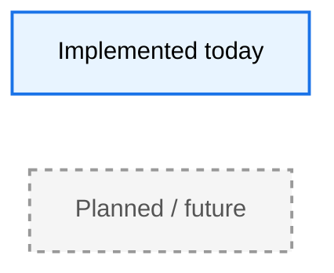
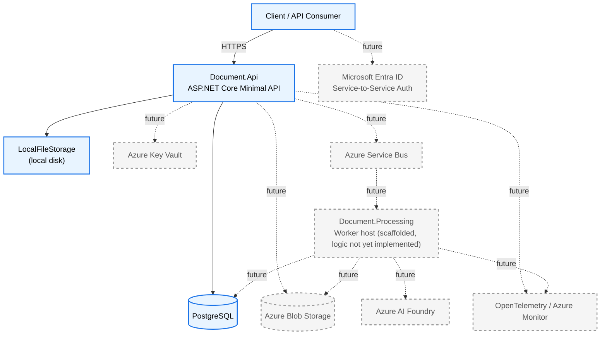
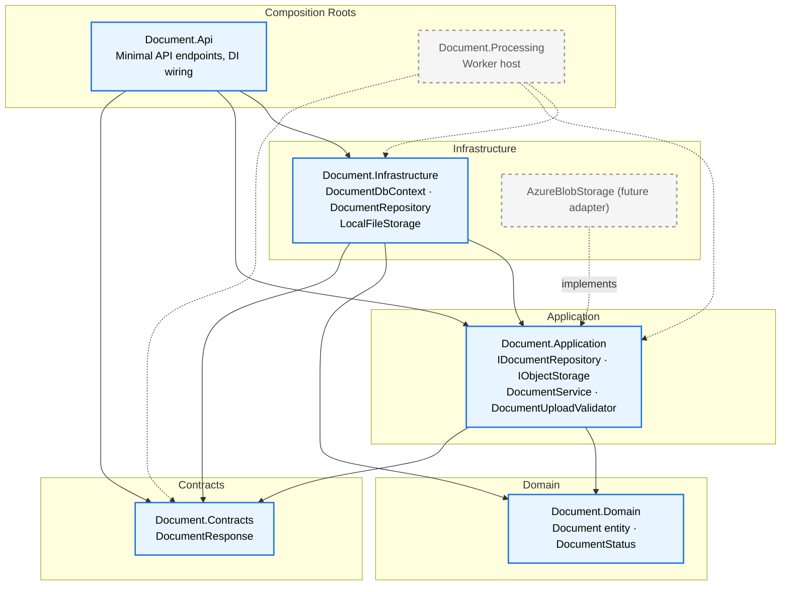
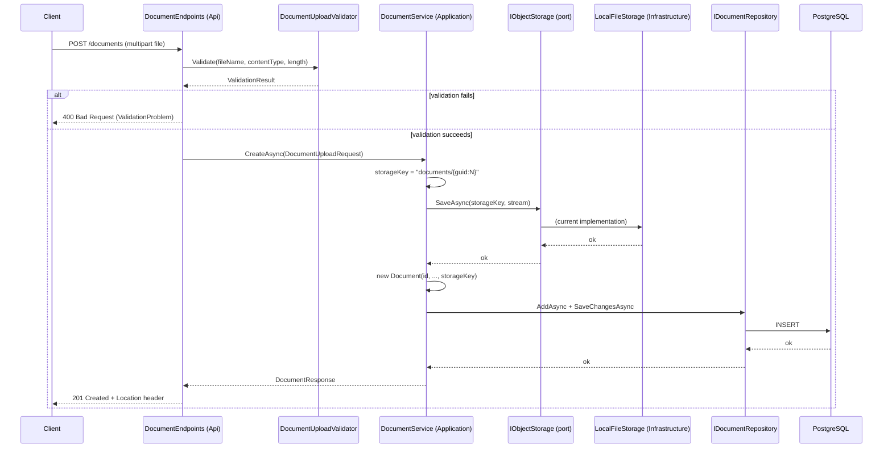
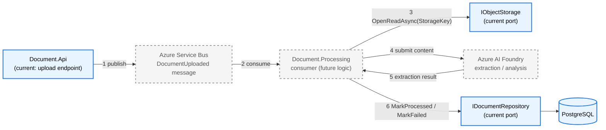
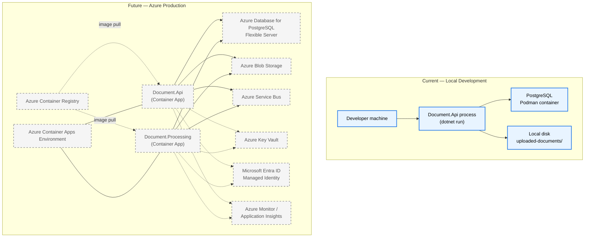

# Document Intelligence Platform — Architecture

**Legend:** solid blue = implemented today · dashed gray = planned / future

---

## 1. High-Level System Architecture

Today, `Document.Api` is the only active entry point: it validates and persists uploaded documents to PostgreSQL and local disk. `Document.Processing` exists as an empty worker-host project with no processing logic yet. Everything Azure-labeled is unimplemented — `IObjectStorage` and the Clean Architecture boundaries exist specifically so these can be added without touching Application or Domain code.

---

## 2. Clean Architecture Layer Diagram

Dependencies point inward only: `Domain` has zero dependencies, `Application` depends only on `Domain`/`Contracts`, and `Infrastructure` depends on `Application` to implement its ports (`IDocumentRepository`, `IObjectStorage`) — never the reverse. `AzureBlobStorage` will slot into `Infrastructure` beside `LocalFileStorage` as a second `IObjectStorage` implementation with no change to any inner layer.

---

## 3. Upload Request Sequence Diagram

Entirely current behavior, verified end-to-end against a live PostgreSQL instance. Note `SaveAsync` returns nothing interpretable — `DocumentService` generates the opaque `StorageKey` itself and never receives a path or URL back.

---

## 4. Future Processing Pipeline

None of steps 1–6 exist yet. The design intent: `Document.Api` publishes a message after step 6 of the upload flow above; `Document.Processing` consumes it, reads the file through the *same* `IObjectStorage` port already in place (no new storage code needed), sends it to AI Foundry, and updates `Document.Status` via the *same* `IDocumentRepository` already in place. The processing pipeline is designed to reuse existing Application-layer ports rather than invent parallel ones.

---

## 5. Deployment Diagram

Today's "deployment" is a developer running `Document.Api` directly on the host against a single Podman-hosted PostgreSQL container — no orchestration, no containerized Api. The future column shows both services running as Azure Container Apps under one environment, each with a Managed Identity (no connection strings or account keys in configuration), pulling from Azure Container Registry, and authenticating to PostgreSQL/Blob Storage/Key Vault/Service Bus via that identity — consistent with the "never hardcode secrets" and Managed Identity requirements already in place for local dev connection strings.
