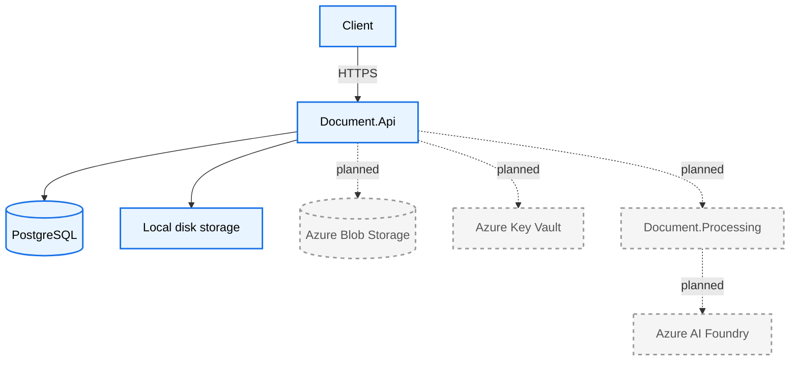
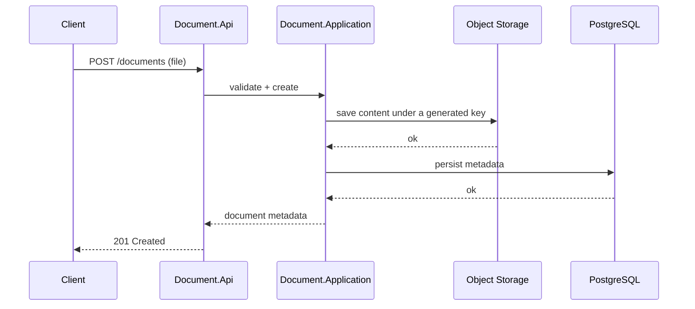
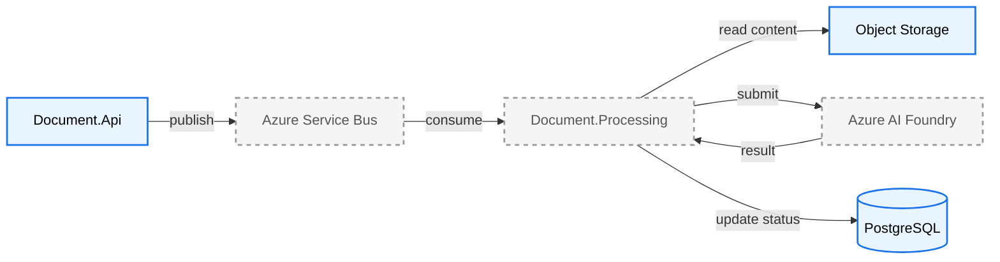
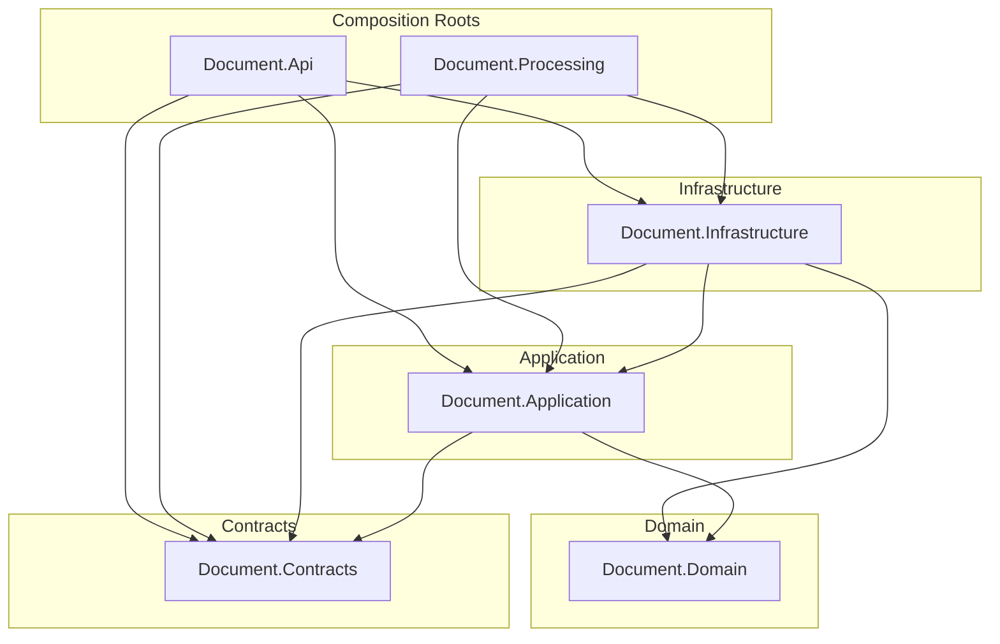

# System Overview

Organizations that receive documents from external parties — invoices, contracts, forms, correspondence — need a reliable way to capture them, track their state, and eventually extract structured data from them. Manual handling doesn't scale, and ad hoc scripts lack auditability, consistent error handling, and a clear separation between ingestion and processing.

Document Intelligence Platform addresses the ingestion and lifecycle-tracking half of this problem today: it accepts a document upload, validates it, persists its metadata and content durably, and tracks its processing status. It is designed with an explicit, non-breaking path to add automated AI-based extraction next, without redesigning what exists today.

# Goals

- Reliable document ingestion with validation and durable metadata tracking
- A storage design that costs nothing in development and swaps to Azure Blob Storage in production without changing Application-layer code
- A processing status model (`Uploaded` → `Processing` → `Processed`/`Failed`) that can support asynchronous, AI-based extraction once implemented
- Deployment readiness for container orchestration — health checks that distinguish liveness from readiness
- A codebase structured so each item on the Azure roadmap can be added as an isolated, additive change rather than a rewrite

# Current Architecture

Implemented today: document upload and retrieval, PostgreSQL persistence, local file storage, and health checks — nothing further along the roadmap exists yet.

- **`Document.Api`** exposes two endpoints — upload and retrieve-by-id — plus liveness, readiness, and overall health checks.
- **PostgreSQL** stores document metadata (identity, original file name, content type, status, timestamps) via EF Core, with migrations checked into source control.
- **Local disk storage** holds uploaded file content behind a storage abstraction, addressed by an opaque, GUID-based key rather than a file path.

# Future Architecture

Planned, not implemented: an asynchronous processing pipeline and a set of Azure-native production dependencies.

- **Azure Blob Storage** becomes a second implementation of the existing storage abstraction — no Application-layer change required.
- **Azure Service Bus** decouples upload (`Document.Api`) from processing (`Document.Processing`), so the two scale independently.
- **Azure AI Foundry** performs the actual document extraction/analysis once a document reaches the processing worker.
- **Azure Key Vault** and **Microsoft Entra ID** (service-to-service authentication) remove secrets from configuration in favor of managed identity.
- **OpenTelemetry** provides tracing/metrics across both services once they're distributed.

# Clean Architecture

- **Domain** holds entities and their invariants. It has no dependencies on any other project and no knowledge of persistence, HTTP, or storage.
- **Application** holds use cases and the abstractions ("ports") those use cases depend on — a repository interface, a storage interface. It depends only on Domain and Contracts, never on a concrete database or file system.
- **Contracts** holds the DTOs exposed at the API boundary. It has no dependencies, so it can be depended on by every other layer without creating a cycle.
- **Infrastructure** provides concrete implementations ("adapters") of Application's ports — the database access layer, the storage implementations. It depends on Application, never the reverse.
- **Api** and **Processing** are composition roots: the only projects allowed to know which concrete implementation is wired to which abstraction, via dependency injection.

The dependency rule is enforced by the project reference graph itself, not by convention: an inner layer cannot accidentally reference an outer one, because no such project reference exists.

# Main Design Decisions

- **Clean Architecture with an enforced dependency rule** — chosen so that persistence, storage, and web-framework concerns can each change independently without rippling into business logic.
- **PostgreSQL with EF Core** — an open-source relational database with first-class Azure support (Azure Database for PostgreSQL) and a mature EF Core provider, avoiding a mismatch between local development and the eventual Azure target.
- **A storage abstraction with an opaque storage key** — Application generates and owns the key; the storage implementation never returns a path or URL for Application to hold onto, which is what makes swapping local disk for Blob Storage a purely additive change.
- **Separate liveness and readiness health checks** — liveness never depends on PostgreSQL, so a slow or unavailable database causes traffic to stop routing to an instance without triggering a container restart.
- **Minimal APIs over MVC controllers** — the API surface is small and endpoint-focused; Minimal APIs avoid the controller/action machinery that isn't needed here.
- **Podman instead of Docker for local dependencies** — a deliberate, project-wide tooling choice for local container workloads.

# Folder Structure

| Project | Responsibility |
|---|---|
| `Document.Domain` | Entities and enums. No dependencies. |
| `Document.Application` | Use cases and ports (repository and storage abstractions, validation). Depends only on Domain and Contracts. |
| `Document.Contracts` | DTOs exposed at the API boundary. No dependencies. |
| `Document.Infrastructure` | Concrete implementations of Application's ports: database access, storage. Depends on Application. |
| `Document.Api` | HTTP API host and composition root. |
| `Document.Processing` | Background processing host and composition root. Scaffolded; not yet implemented. |

# Technology Stack

**Current**
- .NET 10 / ASP.NET Core
- Entity Framework Core
- PostgreSQL
- Local object storage
- Podman (local development dependencies)

**Planned**
- Azure Blob Storage
- Azure Key Vault
- Azure AI Foundry
- Azure Container Apps
- Service-to-service authentication (Microsoft Entra ID)
- OpenTelemetry

# Scalability considerations

- `Document.Api` itself is stateless and can scale horizontally, but local disk storage currently ties uploaded content to a single instance — a real constraint that Azure Blob Storage removes.
- PostgreSQL runs as a single local instance today; a production deployment needs a managed, scalable instance with connection pooling sized for the expected number of concurrent API instances.
- Separating upload (`Document.Api`) from processing (`Document.Processing`) via a message broker allows the two to scale independently — a burst of uploads doesn't need to be matched by processing capacity in real time.
- There is no caching layer; metadata retrieval reads PostgreSQL directly on every request, which is adequate at current scale but worth revisiting if read volume grows significantly.
- Uploads are not chunked or resumable, which bounds practical file size regardless of how the rest of the system scales.

# Security considerations

- No end-user authentication exists yet; only service-to-service authentication is on the roadmap, for internal calls between services.
- Connection strings and other configuration values are never hardcoded — local development uses user secrets, and production is designed around managed identity rather than stored credentials.
- Upload validation constrains content type and file size, and storage keys are generated server-side rather than derived from client-supplied file names, which removes a path-traversal vector by construction.
- Uploaded content is not scanned for malware; this is a known gap that would need to be addressed before accepting uploads from untrusted external parties in production.
- HTTPS is enforced at the transport level.

# Deployment overview

Today, the system runs as a single `Document.Api` process on a developer machine against a PostgreSQL instance in a local Podman container — there is no orchestration and nothing is containerized beyond the database.

The planned production deployment runs `Document.Api` and `Document.Processing` as separate Azure Container App instances within one Container Apps environment, backed by Azure Database for PostgreSQL, Azure Blob Storage, and Azure Service Bus, with Azure Key Vault and managed identity replacing all stored credentials, and OpenTelemetry data flowing to Azure Monitor. A detailed deployment diagram is maintained separately in [`docs/architecture/README.md`](README.md).
